<div align="center">

# Fittable | Frontend

Scheduling dashboard for university student office assistants. Syncs work shifts and university timetables into a single calendar, streamlines schedule creation, and automates work document generation to replace manual spreadsheet workflows.

<br/>


<br/>

▶ Click to watch demo

[](https://www.youtube.com/watch?v=Se2Nv5h_u2k)

</div>

---

## Screenshots

| University Portal Login | My Shift Schedule |
|---|---|
| 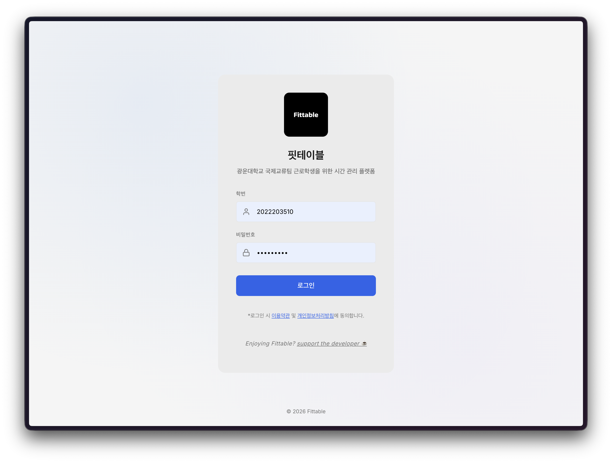 | 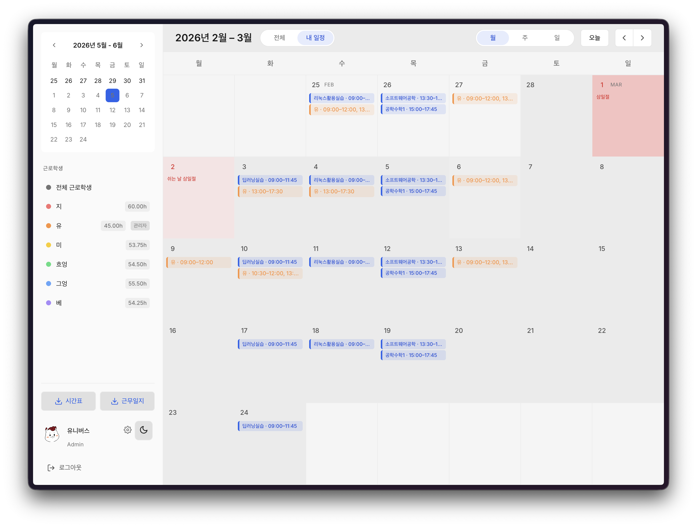 |

| Team Schedule Dashboard | Timetable Sync · Week View |
|---|---|
| 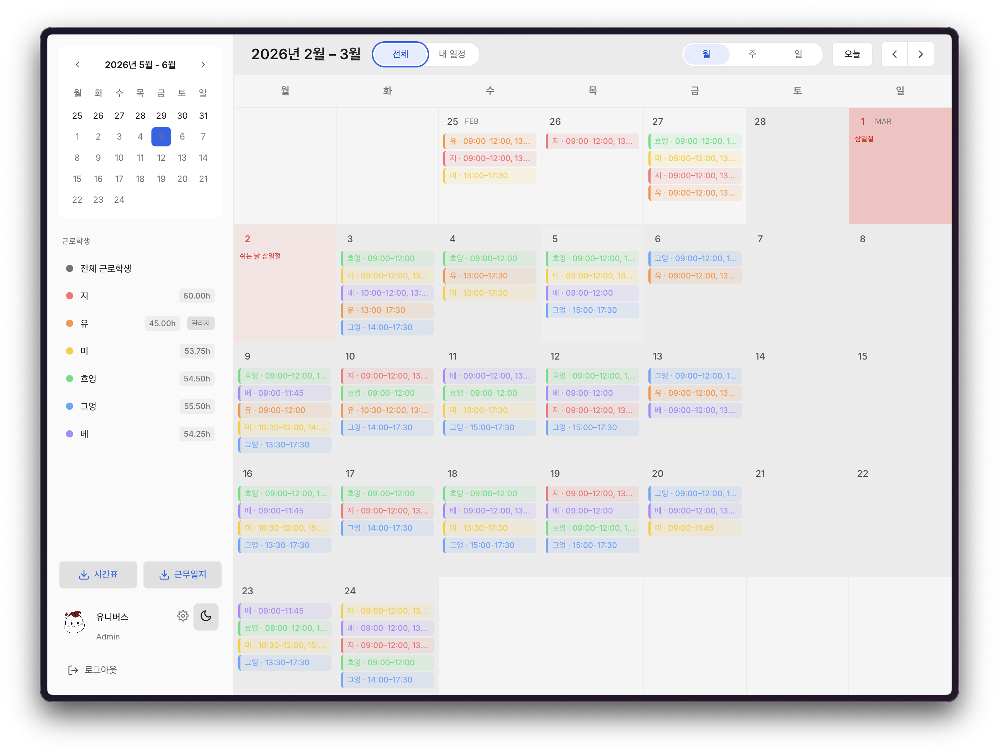 | 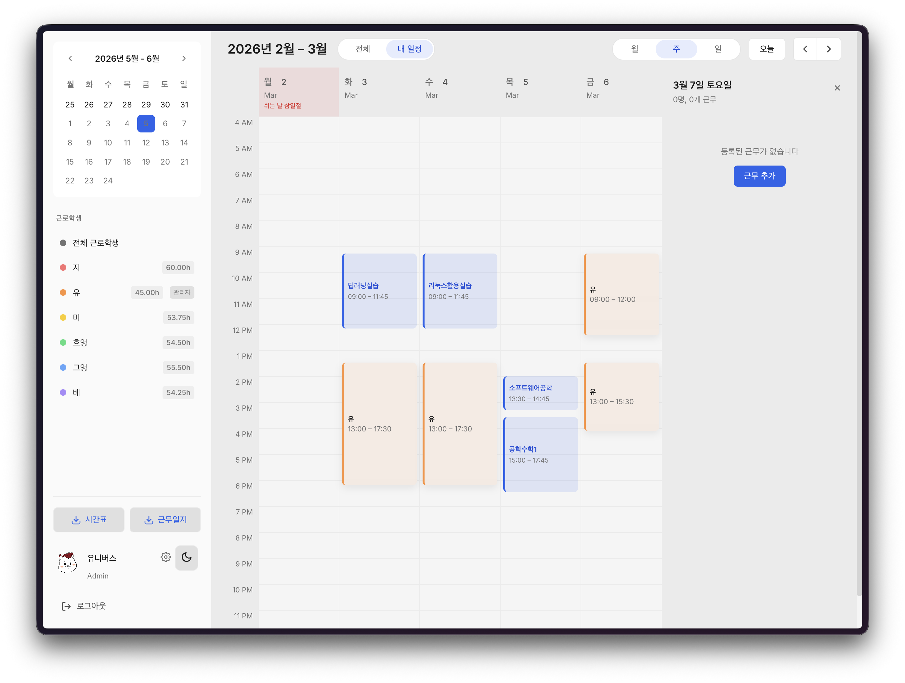 |

| Multi-day Shift Creation | Dark Mode |
|---|---|
| 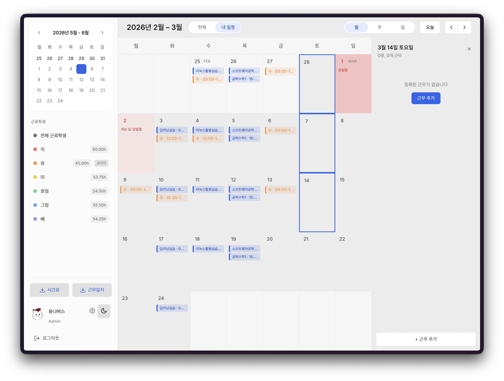 | 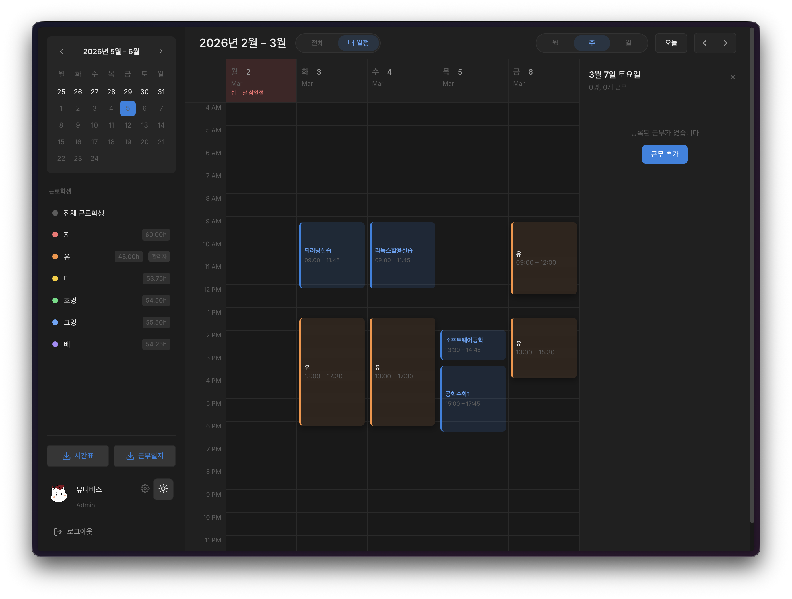 |

| Work Schedule Export | Work Log Document Generation |
|---|---|
| 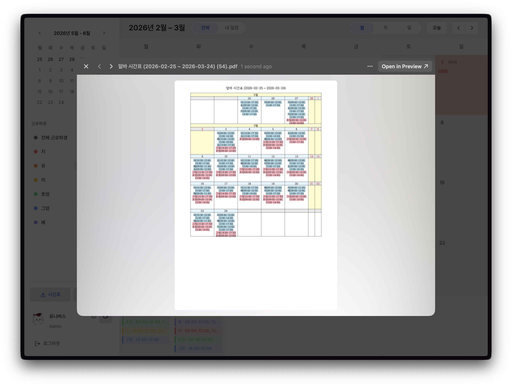 | 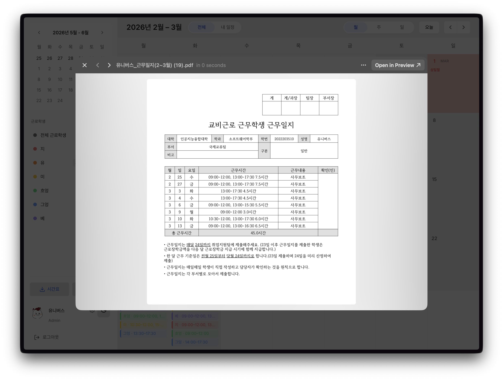 |

| Student Profile Card |
|---|
| 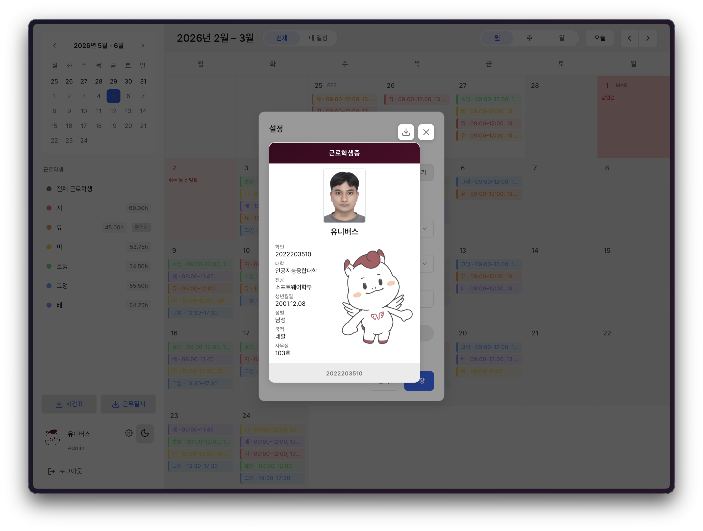 |

---

## System Architecture

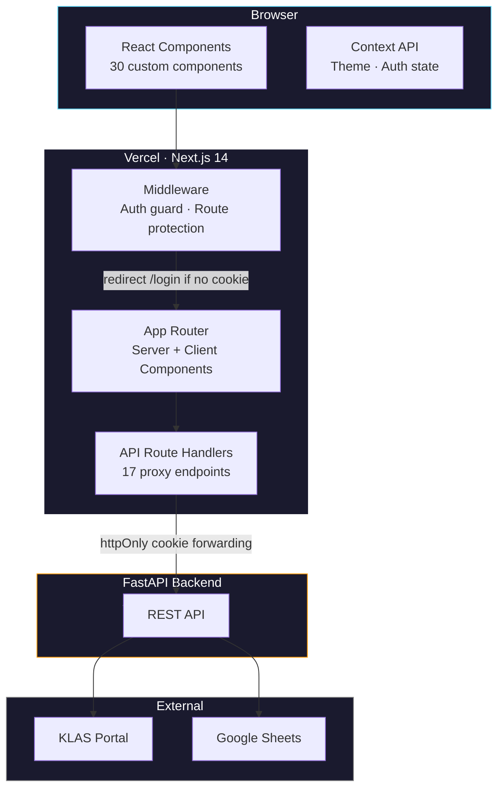

---

## Data Flows

### 1. Authentication Flow

All auth state lives in httpOnly cookies — the browser never touches the token directly. Next.js middleware enforces protection at the edge before any component renders.

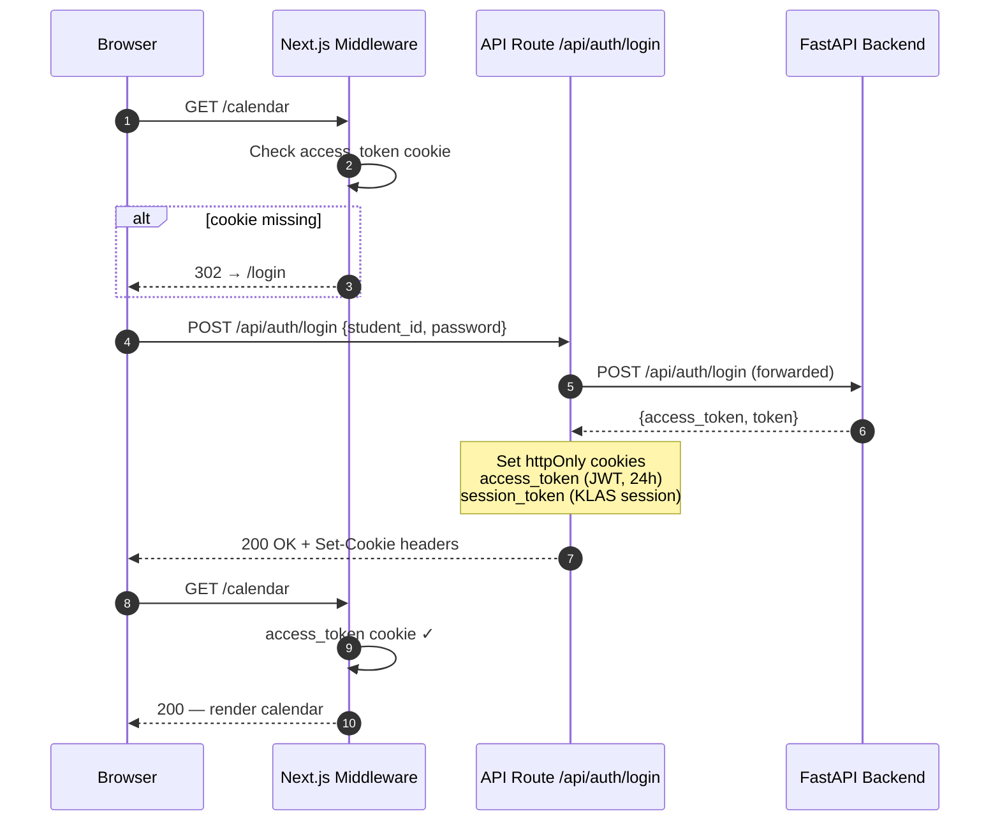

---

## Component Architecture

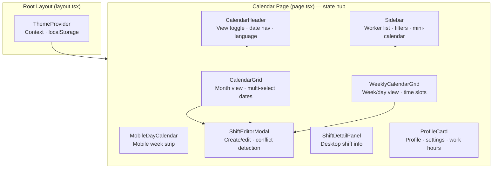

---

## Project Structure

```
app/
├── api/              # 17 API proxy route handlers (auth, shifts, holidays, users…)
├── calendar/         # Main protected page — calendar orchestrator
├── login/            # Auth page with error state from URL params
├── globals.css       # 60+ CSS custom properties (dual theme)
└── layout.tsx        # Root layout with ThemeProvider

components/           # 30 fully custom components
lib/
├── api.ts            # Typed fetch wrapper — all 18 endpoint functions
├── types.ts          # 20+ TypeScript interfaces (Shift, User, Holiday, TimetableEntry…)
├── i18n.ts           # Bilingual Ko/En translation system
├── workMonth.ts      # 25th–24th payroll cycle date math
└── theme.ts          # Theme persistence + DOM application

middleware.ts         # Edge auth guard — protects /calendar/* routes
```

---

## Local Setup

```bash
npm install
cp .env.example .env.local   # set BACKEND_URL
npm run dev
```

| Variable | Description |
|---|---|
| `BACKEND_URL` | FastAPI backend URL (e.g. `http://localhost:8000`) |

| Script | Description |
|---|---|
| `npm run dev` | Start dev server on port 3000 |
| `npm run build` | Production build |
| `npm run lint` | ESLint check |
